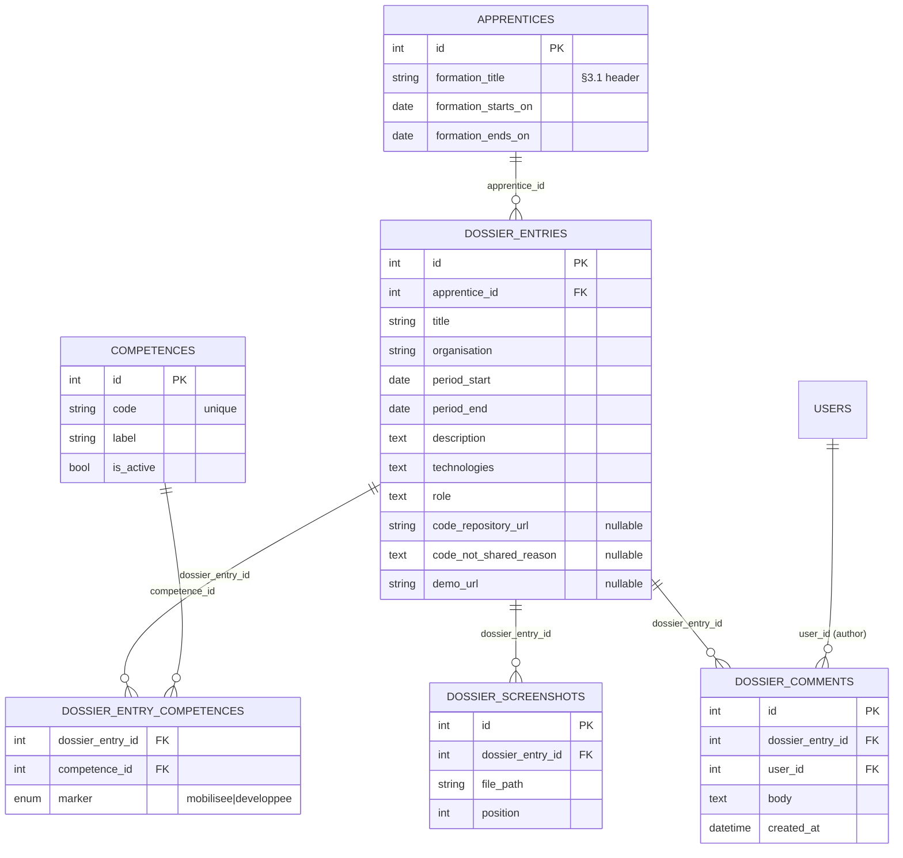

# Spec: Dossier de Formation

**Status:** current. Rewritten as the **product spec** (Laravel + Inertia + PostgreSQL). The earlier revision specced a
localStorage proof of concept; that POC is built, and its durable contribution — the field list, derived from the
official brief — is carried forward below.

| | |
|---|---|
| **Source of truth for scope** | `docs/user_stories/user_story.md`, **DOS** track |
| **Sibling spec — grades** | `docs/spec-d/spec.md` |
| **Assembly view** | `docs/spec-d/architecture.md` |
| **Official brief** | `JT_DEV_B09_1.5 — Création et maintenance du dossier de formation`, §3.1 and §3.2. Not committed to this repository |
| **Proof of concept** | `poc-grade-manager/` in the `second-group-project` repository — static HTML/CSS/JS on `localStorage`. Already built. Informs the field list, not the architecture |

## Thesis

**Each apprenti builds their dossier de formation inside the app instead of hand-formatting a document.**

They record projects — one entry per project, carrying every field the official brief requires — and the app renders
them into the firm's official layout and exports a PDF. Their coach, formateur and the admin can read it and comment.

## Scope

**v1 is Informatique développement d'applications apprentis only** (per the DOS track's scope note). Nothing here is
gated on that today beyond which apprentis are told to use it; if it needs enforcing, that is Open Question #3 below.

## Roles

| Role | What they do |
|------|--------------|
| **Apprenti** | Creates, edits and deletes their own projects. Sees the live preview. Exports the PDF. Reads comments. (DOS-01…09, DOS-14) |
| **Coach** | Reads the dossier of apprentis assigned to them. Comments. (DOS-10, DOS-13) |
| **Formateur** | Same read + comment access, for apprentis assigned to them. (DOS-11, DOS-13) |
| **Admin** | Reads any apprenti's dossier. Comments. Manages the compétences catalog (ADMIN-08). (DOS-12, DOS-13) |

> **Reversal from the POC.** The POC decided the dossier was private — coach access none at all. **DOS-10, DOS-11 and
> DOS-12 override that**: coach, formateur and admin all read it. The backlog is the source of truth, so the POC's
> decision does not carry over.

Scoping matches the grades track exactly: `apprentices.coach_id` / `apprentices.formateur_id`, enforced at the query
layer and by policy. Admin sees everyone. Read-only for all three — nobody edits an apprenti's project but the apprenti.

## Project fields

Every field is required by the official brief (§3.2) unless marked optional. This list is the durable output of the POC
work and of Nikyta's walkthroughs; it supersedes the thinner field set the DOS cards imply.

| Field | Type | Notes |
|---|---|---|
| `title` | string | The project's name. |
| `organisation` | string | §3.2 "contexte de réalisation" — the firm or organisation the project was done for or within. |
| `period_start` | date | §3.2 wants a duration, not a single date. |
| `period_end` | date | |
| `description` | text | What was done. The brief's "buts principaux" folds in here rather than getting its own textarea. |
| `technologies` | text | Free text, deliberately not a tag system or catalog — listing every technology as structured data is more pain than it is worth. |
| `role` | text | Free text. The apprenti's role and responsibilities on the project. |
| `code_repository_url` | string, optional | Link to the source. |
| `code_not_shared_reason` | text, conditional | **Expected when `code_repository_url` is empty** — the brief requires a link *or* a reason. |
| `demo_url` | string, optional | Live demonstration, where one exists. |
| **compétences** | pivot, ≥1 required | Each selected compétence is marked **mobilisée** (an existing skill applied) or **développée** (learned or improved on this project). A flat list of codes silently drops that distinction, which the brief mandates. |
| **screenshots** | file[], optional | Stored on disk like grade PDFs, served through an authorized route. The brief notes screenshots should be anonymised where necessary — that is the apprenti's responsibility, there is no in-app redaction tool. |

Plus the **dossier header** (§3.1), which is not per-project: the apprenti's name, their formation title, the formation
period, and a sommaire — the list of project titles, computed live.

## Data model



Notes:

- **`apprentices` gains three columns** rather than a new entity — the formation header belongs to the apprenti, not to
  a project. There is **no `dossiers` table**: an apprenti's dossier *is* their entries plus those three fields.
- **`dossier_entry_competences` is a normalized pivot**, not a JSON column. This matches the grades track's reason for
  choosing PostgreSQL — typed columns and real constraints over schemaless flexibility — and it is what makes
  "which apprentis have developed compétence X?" a query rather than a scan.
- **`competences` is the ADMIN-08 catalog.** The official ICT compétence list has not been sourced yet; seed it with
  clearly-labelled placeholders until it is (Open Question #1).
- **Ordering is chronological by `period_start`.** No manual reorder column. Grouping by compétence is a display concern
  and is deferred.
- **`dossier_comments` is a separate table from `comments`** (grades). Same shape, different parent; sharing one
  polymorphic table buys nothing at this size.

## Flows

### Creating or editing a project (DOS-01, DOS-02, DOS-08)

```
Dossier/Edit — two panes
┌────────────────────────────┬────────────────────────────┐
│  Project form              │  Live preview              │
│  every field above         │  the entry as it will      │
│  compétence checklist      │  appear in the dossier     │
│  with mobilisée/développée │  re-rendered as the form   │
│  screenshot upload         │  changes                   │
└────────────────────────────┴────────────────────────────┘
   Cancel · Save
```

The preview is **client-side and derived from current form state** — it is never a stored artifact and can never go
stale. That is what DOS-06 ("regenerate on new project") actually means: the view is always computed, so there is
nothing to regenerate.

### Viewing and exporting (DOS-04, DOS-05, DOS-07)

```
GET /dossier                      the apprenti's own dossier
GET /apprentices/{a}/dossier      coach · formateur · admin, policy-scoped
     │
     ├─ header: name · formation title · formation period · sommaire
     ├─ each entry, chronological by period_start, all fields + screenshots
     └─ [ Exporter en PDF ] ──▶ spatie/laravel-pdf ──▶ download
```

DOS-05 — designing the HTML/CSS template — is a real deliverable and the same template serves both the on-screen view
and the PDF. **Server-side rendering via `spatie/laravel-pdf`** (Browsershot / headless Chrome), replacing the POC's
`window.print()`. This puts headless Chrome and Node on the deployment target; see Open Question #6 in
`docs/spec-d/spec.md`.

### Comments (DOS-13, DOS-14)

Comments attach to a **project entry**, not to the dossier as a whole. Coach, formateur and admin write; the apprenti
reads. Same one-direction shape as grade comments — no replies.

## Architecture

```
app/
├── Http/Controllers/
│   ├── DossierController.php            index · show · export
│   ├── DossierEntryController.php       create · store · edit · update · destroy
│   └── DossierCommentController.php     store
├── Models/
│   ├── DossierEntry.php · Competence.php · DossierScreenshot.php · DossierComment.php
├── Policies/
│   ├── DossierEntryPolicy.php           apprenti: own (write) · coach/formateur: assigned (read) · admin: all (read)
│   └── DossierCommentPolicy.php         create: coach/formateur/admin · view: the apprenti too
└── Services/
    └── Dossier/
        └── DossierPdf.php               render the template -> PDF via spatie/laravel-pdf

resources/js/Pages/Dossier/
├── Index.vue|jsx      project list + "Create project"
├── Edit.vue|jsx       two-pane form + live preview
└── Show.vue|jsx       one project, full detail, comments

resources/views/dossier/
└── document.blade.php  the official layout — serves both the on-screen render and the PDF (DOS-05)
```

Admin CRUD for the compétences catalog is `Admin/CompetenceController` and lives in `docs/spec-d/spec.md` (ADMIN-08).

UI components: shadcn/ui (or shadcn-vue) pulled in per-surface — the entry form, the compétence checklist, the
screenshot uploader. The `.vue` / `.jsx` extension above depends on `docs/frontend-decision.md`.

## MVP scope

### In
- Create, edit, delete a project with the full §3.2 field set (DOS-01, DOS-02, DOS-03, DOS-08, DOS-09)
- Compétence selection from the ADMIN-08 catalog, each marked mobilisée or développée, at least one required
- Screenshot upload, stored and served like grade PDFs
- Dossier header from the apprenti's formation fields, with a live sommaire
- Live preview beside the form (DOS-04, DOS-06)
- The official HTML/CSS template, serving both the screen and the PDF (DOS-05)
- Server-side PDF export (DOS-07)
- Coach, formateur and admin read access, policy-scoped (DOS-10, DOS-11, DOS-12)
- Comments on a project; the apprenti reads them (DOS-13, DOS-14)

### Out
- Formateur review/annotation workflow beyond comments, and any evaluation or sign-off step
- A catalog of official Jobtrek *projects* to pick from — projects are free-form
- Multiple dossiers per apprenti
- Manual drag-reorder, and the group-by-compétence view (deferred — cheap to add, compétences are already structured)
- In-app screenshot anonymisation or redaction
- Email notification on a dossier comment — the grades track has one (GR-15); no DOS story asks for it
- Real official compétence codes, until the ICT list is sourced

## Risks

| Risk | Mitigation |
|------|------------|
| **Placeholder compétence codes get mistaken for real data.** Everything downstream keys off `competences.code`. | Label them `(placeholder)` in the seeder and refuse to demo compétence rollups until the real list lands. Open Question #1. |
| **`spatie/laravel-pdf` needs headless Chrome + Node on the server**, which the deployment target may not have. | Settle Open Question #6 in `docs/spec-d/spec.md` before week 5, not during the demo. Fallback: browser print-to-PDF from the same template, which is what the POC does. |
| **DOS-05 (the template) is a design deliverable hiding inside a backlog card.** It blocks DOS-04, DOS-06 and DOS-07 and it is not a half-day job. | Schedule it as its own piece of work, early. Everything visual in this track waits on it. |
| **Live preview is easy to over-engineer.** Re-rendering a full document layout on every keystroke invites performance work nobody budgeted. | Render from form state with a debounce. It is a preview, not the export — the PDF is authoritative. |
| **Scope drift toward an evaluation/review product.** | The Out list above is the boundary. Anything resembling sign-off, grading a project, or an official project catalog is a new conversation. |

## Open questions

1. **The official ICT compétence list has not been sourced.** Blocks nothing structurally — the catalog table and the
   pivot are correct regardless — but no demo of compétences is honest until it lands.
2. **One PDF per project, or one PDF for the whole dossier?** DOS-04 and DOS-07 say the dossier ("my dossier preview",
   "export dossier as PDF"). Nikyta's walkthroughs say one PDF per project. **This spec follows DOS**, since the backlog
   is the source of truth — but it is a genuine disagreement and the brief should settle it.
3. **Is v1 actually restricted to Informatique apprentis?** The DOS scope note says so. Nothing in the data model
   enforces it, and no story asks for enforcement. If it must be enforced, it needs a rule and probably a section check.
4. **Does an apprenti keep editing a project after a coach has commented on it?** Same shape as Open Question #8 in
   `docs/spec-d/spec.md` (editing a grade that was already emailed out), and it deserves the same answer.
