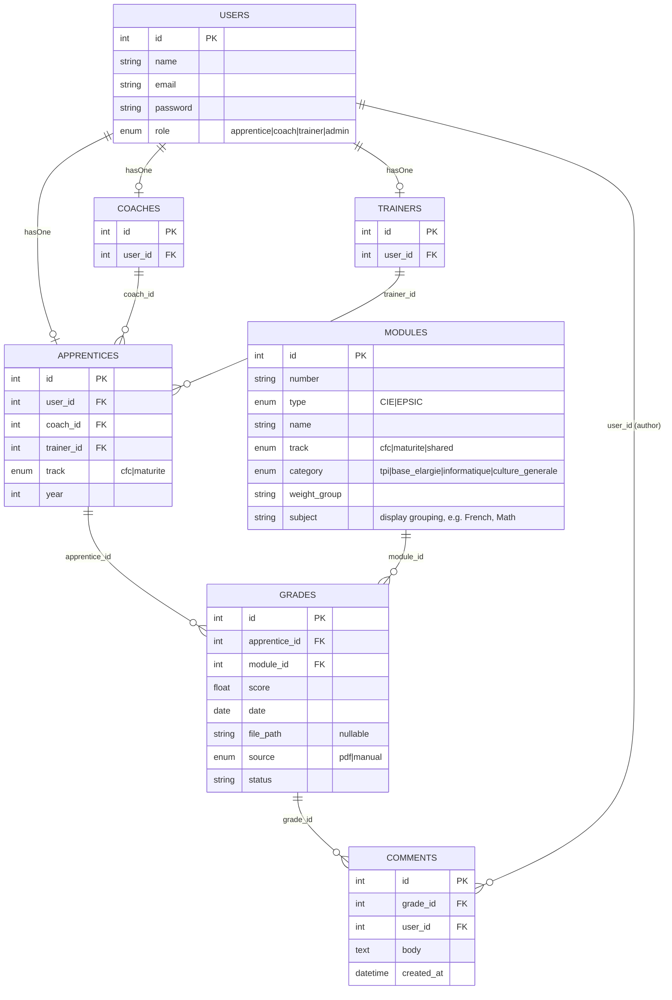

# Architecture — Plan D

**Status:** derived from `.scratch/plan-d/spec.md`. PDF-only upload, no email intake of any kind, no spreadsheet.

## System overview

```
┌─────────────┐        upload PDF + form        ┌───────────────────────┐
│ Apprentice  │ ───────────────────────────────▶│  Laravel + Inertia     │
│ (browser)   │◀─────── grades + average ────────│  app (single monolith) │
└─────────────┘                                  └───────────┬───────────┘
┌─────────────┐                                              │
│   Coach     │◀── assigned apprentices only ────────────────┤
│ (browser)   │                                              │
└─────────────┘                                              │
              ┌───────────────────────────────────┬──────────┴─────────────┐
              ▼                                   ▼                        ▼
    ┌──────────────────┐              ┌──────────────────────┐   ┌──────────────────┐
    │ Local disk        │              │ MySQL / SQLite       │   │ Mailtrap (SMTP)   │
    │ storage/app/      │              │ users, apprentices,  │   │ dev only —        │
    │ grades/*.pdf      │              │ grades, modules,     │   │ notify coach +    │
    └──────────────────┘              │ mapping_table        │   │ trainer           │
                                       └──────────────────────┘   └──────────────────┘
```

No inbound network dependency, no scheduled jobs, no polling, no OAuth, no spreadsheet library. The single outbound call is SMTP to Mailtrap, swappable for any real provider via Laravel's mail config.

The DB is the **only** system of record. Grades are read back through the app's own pages, and the weighted average that the canevas `Totaux` sheet used to compute is now computed in PHP.

## Database schema



`users` is the sole authentication table; `apprentices`/`coaches`/`trainers` are one-to-one profile rows keyed off `role`. `apprentices.coach_id`/`trainer_id` drive query-layer scoping (see "Authorization and scoping" below). `modules.category` drives the weighted average; `modules.subject` drives the coach's grouped test list — deliberately separate fields, see `spec.md`.

## Request flow: submitting a grade

```
1. Apprentice opens Grades/Upload (Inertia/React)
2. Selects a PDF (optional — data-only grades allowed)
3. POST /grades/prefill  [optional convenience call]
     ├─ FilenameParser(original_filename)  → module ref, date, score (score only if encoded)
     ├─ MappingTable.resolve(filename_substring) → module_id
     └─ returns suggestions; every field stays editable
4. Form renders, prefilled where possible, blank otherwise
5. Apprentice completes/corrects the form, submits
6. POST /grades  (GradeController@store)
     ├─ validate: score in range, module.track matches apprentice.track (reject, don't hide)
     ├─ GradeService::store()   — persist Grade row
     ├─ GradeService::rename()  — apply JT convention, move into storage/app/grades/
     └─ GradeService::notify()  — Mail to coach + trainer, renamed PDF attached, via Mailtrap
7. Redirect to Grades/List — the grade appears, weighted average recomputed on read
```

## Request flow: coach drill-down

```
1. GET /coach/apprentices
     └─ CoachController@index scopes to Apprentice::where('coach_id', $coach->id),
        annotates each with track, weighted average, last_activity (MAX(grades.created_at))
     → Coach/Dashboard.jsx: one row per apprentice, read-only

2. GET /coach/apprentices/{apprentice}
     └─ CoachController@show — ApprenticePolicy::view (403 if not this coach's apprentice)
     └─ Grade::where('apprentice_id', ...)->with('module')->get()->groupBy('module.subject')
     → Coach/ApprenticeGrades.jsx: tests grouped by subject (French, Math, ...), grade beside each

3. GET /coach/apprentices/{apprentice}/grades/{grade}   (apprentice reaches the same page via GET /grades/{grade})
     └─ GradeController@show — GradePolicy::view
     └─ Grade + comments eager-loaded; `can.comment` prop computed from CommentPolicy::create
     → Grades/Show.jsx: react-pdf render + comment thread
         - coach: comment form visible
         - apprentice: thread visible, no form (policy-driven, not UI-hidden)
```

Every step is synchronous inside one Laravel request. No queue worker, no background job. (Queueing `notify()` is a reasonable later optimization; at demo scale it buys nothing.)

## Component map

```
app/
├── Http/Controllers/
│   ├── GradeController.php        # prefill (POST), store (POST), index, show
│   ├── CoachController.php        # index: apprentice list · show: one apprentice's tests
│   └── CommentController.php      # store (coach only, CommentPolicy::create)
├── Models/
│   ├── User.php                   # authenticatable; role: apprentice|coach|trainer|admin
│   ├── Apprentice.php             # user_id, coach_id, trainer_id, track, year
│   ├── Coach.php                  # user_id
│   ├── Trainer.php                # user_id
│   ├── Grade.php                  # apprentice_id, module_id, score, date, file_path?, source: pdf|manual
│   ├── Module.php                 # number, type CIE|EPSIC, track, category, subject
│   └── Comment.php                # grade_id, user_id, body
├── Policies/
│   ├── GradePolicy.php            # apprentice: own only · coach: assigned apprentices' only
│   ├── ApprenticePolicy.php       # coach: only where apprentice.coach_id === coach.id
│   └── CommentPolicy.php          # create: coach on assigned apprentices' grades · view: apprentice on own grades too
├── Mail/
│   └── GradeNotification.php      # renamed PDF attached
└── Services/
    ├── GradeService.php           # store(), rename(), notify()
    ├── Grading/
    │   └── WeightedAverage.php    # pure: grades + module categories -> weighted CFC average
    └── Prefill/
        ├── FilenameParser.php     # pure: filename -> { module ref, date, score? }
        └── MappingTable.php       # lookup: filename substring -> module_id
database/
├── migrations/                    # users, apprentices, coaches, trainers, grades, modules, comments, mapping_table
└── seeders/                       # DemoUsersSeeder, ModuleCatalogSeeder (per track), MappingTableSeeder
resources/js/Pages/
├── Auth/Login.jsx
├── Grades/
│   ├── Upload.jsx                 # PDF picker + grade form, prefilled where possible
│   ├── List.jsx                   # own grades + weighted average
│   └── Show.jsx                   # react-pdf render + comment thread; shared coach/apprentice, form gated by `can.comment`
├── Coach/
│   ├── Dashboard.jsx              # assigned apprentices: track, weighted average, last activity
│   └── ApprenticeGrades.jsx       # one apprentice's tests, grouped by subject, grade beside each
└── Layouts/
```

Absent by decision: `Jobs/`, `Exports/`, `Services/Inbox/`, any MIME parser, any spreadsheet library.

## Authentication and roles

One `users` table is the authentication boundary. `users.role` is an enum; each non-admin user has exactly one profile row via `hasOne` (see the `USERS`/`APPRENTICES`/`COACHES`/`TRAINERS` relationships in the schema diagram above). `User.role === admin` has no profile row.

This is why `auth()->user()->apprentice` in the query-scoping code is a real relationship rather than an assumption. Login is role-agnostic; the post-login redirect branches on `role`.

## Authorization and scoping

Two roles read the same table through different scopes, enforced at the query layer so a hand-crafted URL can't walk around them:

- **Apprentice** — `Grade::where('apprentice_id', auth()->user()->apprentice->id)`. Another apprentice's grade is a 403 via `GradePolicy::view()`, not a filtered-but-reachable row.
- **Coach** — `Apprentice::where('coach_id', auth()->user()->coach->id)`, then eager-load grades. An apprentice outside that set is a 403 via `ApprenticePolicy`.

**Track scoping** sits one level down, at module selection. The form offers only modules where `modules.track` matches the apprentice's `track` or is `shared`; `GradeController@store` re-checks it server-side and rejects a mismatch. Hiding an option in the UI is not enforcement.

## Weighted average

`Services/Grading/WeightedAverage.php` replaces the canevas `Totaux` sheet. Input: an apprentice's grades joined to their modules' `category`. Output: the weighted average.

```
grades (score, module.category)
   │
   ▼
group by category ──▶ mean per category
   │
   ▼
apply category weights:
   TPI 0.4 · base élargie 0.1 · informatique 0.3 · culture générale 0.2
   (within informatique: école pro 80% / CIE 20%)
   │
   ▼
weighted average  ──▶ rendered on Grades/List and Coach/Dashboard
```

Plain PHP, no formula strings, no spreadsheet round-trip. Computed on read for the MVP — at demo scale (tens of grades per apprentice) caching it is premature.

The weights above are the **CFC** scheme. The maturité scheme is unresolved and blocks this service — see Open Questions #1 in `spec.md`. Do not build against guessed weights.

## Deployment shape

Single Laravel app, single DB, local filesystem for uploads. No queue worker, no cron, no spreadsheet dependency, no external API keys except Mailtrap SMTP credentials in dev. Smallest deployable shape that still holds every grade, computes the real average, and enforces a genuine two-role authorization boundary.

## Testability

Both service families are pure — data in, data out, no network, no auth, no external state:

- `WeightedAverage` — unit-tested against values read off the real canevas, per track. Highest-value test in the suite: it guards the thesis feature.
- `FilenameParser`, `MappingTable` — unit-tested against filename fixtures, including filenames with and without an encoded score.
- Grade submission — feature-tested through the real HTTP pipeline with an uploaded fixture PDF.
- Notification — `Mail::fake()` assertions. **The test suite does not call the Mailtrap API.** Mailtrap is a dev-time eyeball tool; tests stay offline so CI needs no token and no network.
- Authorization and track rules — feature-tested explicitly, including the negative cases (other coach's apprentice → 403, wrong-track module → rejected).

The whole suite runs with no live external service. That was the original reason for abandoning IMAP, and it still holds.
