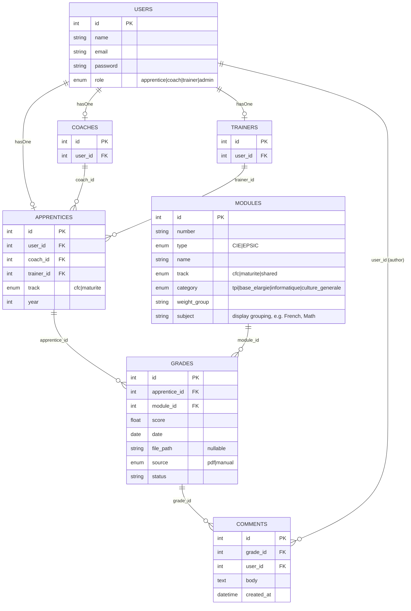

# Spec: Gestionnaire de note — Plan D

**Status:** proposal — current working plan, revised after two grill passes.
**Source:** baseline `.scratch/plan-a/spec.md`, review `.scratch/plan-a/review.md`, superseded alternative `.scratch/plan-c/spec.md`.

## Thesis

**The app replaces the Excel workbook as the system of record for grades.**

That is the whole pitch, and it is deliberately different from where Plan D started. Two earlier framings are now dead:

- Plan C's "the app finds your grade in your inbox" — dead, no mailbox access (see `imap-notes.md`).
- Plan D's first pass, "confirm, don't fill" via dropped `.eml` — dead, dropped by decision. An apprentice-named PDF filename carries too little signal to build an interaction around.

What remains is smaller in ambition and larger in usefulness: a database that holds every grade, computes the weighted CFC average the canevas spreadsheet used to compute, shows an apprentice their own record, shows a coach their assigned apprentices' records, and emails coach + trainer when a grade lands. No spreadsheet in the loop at any point.

## User stories

**Apprentice.** I log in, upload my scanned grade PDF, fill the grade form (module, score, date), submit. The system renames the file per the JT convention, stores it, records the grade, and emails my coach and trainer with the renamed PDF attached. I can see my full grade history and my current weighted average.

**rename files -> figure it out**

Where the filename happens to encode the score, the form arrives pre-filled with it as a suggestion — see "Filename prefill" below. This is a convenience, not the interaction model.

**Coach.** I log in and see a dashboard listing my assigned apprentices — track, current weighted average, and when their record was last updated (the timestamp of their most recent grade). Clicking an apprentice opens their test list, grouped by subject (French, Math, ...), each test shown with its grade. Clicking a test opens the scanned PDF with a comment thread below it — I can write comments there; the apprentice can read them (not reply). Read-only on grade data itself — no editing, no approval step.

Three-level drill-down: **dashboard → apprentice's test list (grouped by subject) → single test (PDF + comments)**. See "Coach dashboard drill-down" below for the routes and data behind each level.


## Decisions taken (grill pass 2)

| # | Question | Decision |
|---|----------|----------|
| 1 | `.eml` intake? | **Dropped.** PDF-only upload. `EmlParser` removed; no MIME parsing anywhere. |
| 2 | Does the filename carry the score? | **Sometimes** — varies by school. Parser attempts it opportunistically; the field is always editable and never assumed correct. |
| 3 | Does the app compute the weighted CFC average? | **Yes.** This is now a headline feature, not a dropped Excel side-effect. |
| 4 | How do roles map to Laravel auth? | **`users` table + role enum + `hasOne` profile** (Apprentice / Coach / Trainer). |

## Data model



Notes on the additions:

- **`users.role` + profile** — authentication is always against `users`; the role enum drives the redirect and the policy checks; the profile row (`apprentices` / `coaches` / `trainers`) holds the domain data. `auth()->user()->apprentice` is a real `hasOne`, not hand-waving.
- **`apprentices.track`** — `cfc` | `maturite`. Gates which modules are valid for that apprentice.
- **`apprentices.trainer_id`** — added because the notify step has always said "coach + trainer" while no plan ever gave trainer a foreign key. Without this the notification cannot be implemented.
- **`modules.track`** — `cfc` | `maturite` | `shared`.
- **`modules.category`** — required by the weighted average (see below). Was implicit in the canevas sheet structure, now explicit.
- **`modules.subject`** — a display grouping (French, Math, ...) for the coach's per-apprentice test list. Deliberately a separate field from `category`: `category` drives the weighted-average calculation (4 canevas buckets), `subject` drives how tests are grouped on screen. Conflating them would force the weighting scheme to also be the UI taxonomy, which the canevas doesn't guarantee.
- **`grades.source`** — `pdf` | `manual` only (`eml` removed).

### Grade status

One persisted state in the MVP: a grade row is created on submit, notification fires in the same request, and the row is `notified`. The four-state machine inherited from Plan C (`incoming → prefilled → confirmed → notified`) described states that never persisted — prefill returned a draft without saving. Keep a `status` column for future use, seed it `notified`, and don't pretend there's a workflow.

## Weighted average

The feature that replaces the canevas `Totaux` sheet. Per the canevas structure:

| Category                          | Weight |
|-----------------------------------|--------|
| TPI                               | 0.4    |
| Compétences de base élargies      | 0.1    |
| Compétences en informatique       | 0.3    |
| Culture générale                  | 0.2    |

Within *Compétences en informatique*: modules école pro 80% / CIE 20%.

Implemented as `Services/Grading/WeightedAverage.php` — a pure function over an apprentice's grades plus their modules' categories. No spreadsheet, no formula strings, plain PHP, unit-tested against values read off the real canevas.

**Open:** the maturité track almost certainly weights differently from CFC (maturité professionnelle has its own scheme). The table above is the CFC scheme. The maturité scheme must be read off the source docs before this is built — see Open Questions #1.

## Coach comments (proposed addition)

Dropped the click-to-annotate idea (positional markers anchored to PDF coordinates) — too much surface for what it's worth. Replaced with a plain comment thread below the rendered PDF: no coordinates, no per-page state, just a `Grade hasMany Comment`.

**Data model.** `comments` table: `grade_id`, `user_id` (author), `body`, `created_at`. `CommentPolicy@create` scoped the same way as `GradePolicy` — a coach may only comment on grades belonging to their assigned apprentices. `CommentPolicy@view` is wider: the apprentice may view (not create) comments on their own grades. One-directional by decision — coach writes, apprentice reads; not a two-way thread. This reverses the earlier "Out" decision on coach comments — see updated MVP scope below.

## Coach dashboard drill-down

Three levels, each gated by the existing policies:

```
1. GET /coach/apprentices
   → CoachController@index
   → Apprentice::where('coach_id', $coach->id), each with:
       track, weighted average (WeightedAverage service), last_activity (MAX(grades.created_at))
   → Coach/Dashboard.jsx: one row per apprentice

2. GET /coach/apprentices/{apprentice}
   → CoachController@show  (ApprenticePolicy::view — 403 if not this coach's apprentice)
   → Grade::where('apprentice_id', $apprentice->id)->with('module')->get()->groupBy('module.subject')
   → Coach/ApprenticeGrades.jsx: tests grouped by subject, grade shown next to each

3. GET /coach/apprentices/{apprentice}/grades/{grade}
   → GradeController@show  (GradePolicy::view — same 403 rule as level 2)
   → Grade + its comments, eager-loaded
   → Grades/Show.jsx: rendered PDF (react-pdf) + comment thread below
       - coach: comment form visible (CommentPolicy::create)
       - apprentice, viewing the same page for their own grade: comment thread visible, no form (CommentPolicy::create denies)
```

`Grades/Show.jsx` is shared between roles — same component, the comment form's visibility is driven by an Inertia prop (`can.comment`) computed server-side from `CommentPolicy`, not a client-side role check. This is the same "enforce at the query/policy layer, don't UI-hide" rule the rest of the spec already applies to grade visibility.

"Last updated" on the dashboard (level 1) is not a new column — it's `MAX(grades.created_at)` per apprentice, computed on read like the weighted average already is. No change to file storage; `storage/app/grades/` stays flat.

**Displaying the PDF.** The scanned grade PDF needs to render inline on the grade detail page (not just a download link) so the comment thread sits directly under it. Use a PDF.js-based React component:
- `react-pdf` (`npm i react-pdf`) — thin wrapper around Mozilla's pdf.js. `<Document file={...}><Page pageNumber={1} /></Document>`. Straightforward, no extra chrome — good fit here since there's no annotation/highlight need anymore.
- Feed it the grade's stored file URL (`storage/app/grades/...` via a signed/authorized route, not a public disk path — the policy check that gates the grade page must also gate the raw file).

**Live updates — decision needed.** Two options, different cost:
- **Polling (default, no new infra).** After posting, or every few seconds, `router.reload({ only: ['comments'] })` (Inertia partial reload). Zero new dependencies, fits the existing `sync`-everything stack.
- **WebSockets (real-time, adds infra).** Laravel Reverb (first-party WebSocket server, ships with Laravel 12) + Laravel Echo on the frontend. A `CommentPosted` event broadcasts on a private channel scoped to the grade (`private-grade.{id}`), authorized in `routes/channels.php` the same way the policy gates the page. Only worth it if the demo wants to show two browsers updating live without a manual refresh — otherwise it's infrastructure (a running Reverb process, `laravel-echo` + `pusher-js` on the frontend, channel auth) for a cosmetic gain in a single-demo-session app.

Recommendation: ship polling for MVP, keep Reverb as a stretch item if a workstream finishes early. See `technological_choices.md` for the reading list on both.

## Filename prefill (reduced scope)

`FilenameParser` runs on the uploaded PDF's original filename and attempts to extract module reference, date, and — where the school encodes it — the score. Results arrive as *suggestions* in the form, all fields editable.

What this is not: a confirmation screen, a confidence score, or a mapping table of sender patterns. Those existed to serve the `.eml` interaction and go with it. `prefill_confidence` is cut — a heuristic score over a handful of regex rules is theater the demo audience cannot evaluate.

The `mapping_table` survives in reduced form: filename-substring → module number, seeded from the naming-convention doc. It is a lookup, not a scoring system.

## Tech stack

| Layer         | Choice                                                       |
|---------------|--------------------------------------------------------------|
| Backend       | Laravel 12                                                   |
| Frontend      | React 19 via Inertia.js                                      |
| Styling       | Tailwind CSS                                                 |
| Auth          | Laravel built-in auth; `users.role` enum + `hasOne` profile; seeded demo users, no register |
| Authorization | Laravel Policies (`GradePolicy`, `ApprenticePolicy`)         |
| File storage  | Local (`storage/app/grades/`)                                |
| Email         | Laravel Mail (Mailable), Mailtrap SMTP driver in dev/test    |
| Grading       | Plain PHP service, no library                                |
| PDF viewer    | `react-pdf` (pdf.js wrapper), inline render on grade detail  |
| Comment updates | Inertia partial reload (polling) for MVP; Laravel Reverb + Echo is a stretch item, not required |

No `maatwebsite/excel`. No MIME parser. No IMAP client. No queue driver beyond `sync`.

## Architecture

```
second-group-project/
├── app/
│   ├── Http/Controllers/        # GradeController, CoachController, CommentController
│   ├── Models/                  # User, Apprentice, Coach, Trainer, Grade, Module, Comment
│   ├── Policies/                # GradePolicy, ApprenticePolicy, CommentPolicy
│   ├── Mail/                    # GradeNotification
│   └── Services/
│       ├── GradeService.php     # store, rename, notify
│       ├── Grading/             # WeightedAverage
│       └── Prefill/             # FilenameParser, MappingTable
├── database/migrations/
├── database/seeders/            # DemoUsersSeeder, ModuleCatalogSeeder (per track), MappingTableSeeder
├── resources/js/Pages/
│   ├── Auth/
│   ├── Grades/                  # Upload.jsx, List.jsx, Show.jsx (PDF + comments, shared coach/apprentice)
│   └── Coach/                   # Dashboard.jsx (apprentice list), ApprenticeGrades.jsx (subject-grouped tests)
└── storage/app/grades/
```

No `Jobs/`, no `Exports/`, no `Services/Inbox/`.

## MVP scope

### In
- Seeded demo users (apprentice ×2 tracks, coach ×2, trainer, admin), simple auth, no register
- `users.role` + profile model, wired to policies
- Two tracks (`cfc`, `maturite`) with track-scoped module catalogs
- PDF upload + grade form, file optional (data-only grades allowed)
- Opportunistic filename prefill as form suggestions
- Rename per JT convention on store
- Coach + trainer email notification, renamed PDF attached, via Mailtrap
- Apprentice grade list + weighted average
- Coach dashboard: assigned apprentices only, their grades + averages, read-only
- Weighted CFC average calculation, unit-tested against the canevas
- Coach comments on a grade (one-directional: coach writes, apprentice reads; no real-time infra)
- Coach drill-down: dashboard (per-apprentice average + last-activity) → subject-grouped test list → single test with PDF + comments

### Out
- `.eml` / IMAP / any email intake — decided against, not deferred
- Confidence scoring on prefill — cut
- PDF click-to-annotate (positional comments anchored to a coordinate on the scanned document) — considered and dropped in favor of a plain comment thread, see "Coach comments" above
- Real-time comment updates via WebSockets (Reverb) — stretch item; polling covers the MVP
- Coach approval workflow, editing grades
- Trainer dashboard (notification-only)
- Excel export in any form
- OneDrive / SharePoint / Microsoft Graph
- Training document management

This is a demo-quality school project, not a production deployment. Seeded fake apprentice data, so no Swiss data-protection work belongs in the 6-week budget.

## Risks

| Risk | Mitigation |
|------|------------|
| **Weighted average formula wrong** — now the headline feature, and it's the risk Plan A's review originally flagged as the biggest | Read the values off the canevas first, encode as unit-test fixtures *before* writing the service. Do this in week 1, not week 4. |
| Maturité weighting scheme unknown | Blocking question — resolve before building `WeightedAverage` (Open Questions #1) |
| Track/module assignment wrong | Validate the split against the canevas before seeding; treat as source data, not a guess |
| Coach sees another coach's apprentice | Policies enforced at the query layer, not UI-hidden; explicitly feature-tested |
| Schema blocks all four devs in week 1 | Accept it: week 1 is a shared schema+auth spike, not four parallel streams (see below) |
| Team learning curve (Laravel 12 + Inertia + React 19 + policies + testing) | If the team hasn't shipped Laravel+Inertia before, weeks 1–2 are partly tutorial time. Budgeted below. |

## Workstream split (4 devs, 6 weeks)

Week 1 is **not** parallel. Every stream depends on the schema and the auth/role model, so those get built once, together, first.

| Week | Plan |
|------|------|
| 1 | **All four, together:** migrations, `users`+role+profile, policies skeleton, seeders, canevas values transcribed into test fixtures. Ends with a schema nobody needs to change. |
| 2–4 | **A:** grade form + upload + list pages · **B:** `GradeService` store/rename/notify + Mailtrap · **C:** `FilenameParser` + mapping table on fixtures · **D:** `WeightedAverage` + module catalog seeder + policies |
| 5 | Coach dashboard, integration, authorization + track feature tests |
| 6 | Polish, demo script, buffer |

Fallback floor if a stream slips: cut the coach dashboard to a plain list without averages. Cut prefill entirely before cutting the average — the average is the thesis.

## Test strategy

- Unit: `WeightedAverage` against real canevas values, both tracks — the highest-value test in the suite
- Unit: `FilenameParser` (incl. filenames with and without an encoded score), mapping table lookups
- Unit: rename logic against JT convention fixtures
- Feature: grade submission end to end (store → rename → notify)
- Feature: notification content, using Laravel's `Mail::fake()` — **not** the Mailtrap API. Mailtrap is for eyeballing real mail in dev; the test suite stays offline.
- Feature: apprentice sees only their own grades
- Feature: coach sees only assigned apprentices; another coach's apprentice returns 403
- Feature: `maturite` apprentice cannot submit against a `cfc`-only module, and vice versa

## Open questions

Unresolved, ordered by how much they block:

1. **Maturité weighting scheme** — the CFC weights are known; maturité's are not. Blocks `WeightedAverage`. Needs a look at the source docs.
2. **Does `year` gate module availability**, the way `track` does? A first-year submitting a fourth-year module should presumably fail. `year` is stored and currently unused.
3. **Retakes / duplicate submissions** — same apprentice, same module, twice. New row, overwrite, or versioned? A system of record needs an answer; the average calculation needs one more.
4. **Grade validation rule** — Swiss 1–6, and in what increments (0.5? 0.25?). Nothing downstream validates any more, so the app is the only guard.
5. **Admin role** — present in Plan A, absent since. Seeder-only user creation means you cannot add an apprentice during the demo. Acceptable?
6. **Deployment + CI** — is the demo localhost, or hosted? Does CI exist, or are tests run locally? Currently unstated.
7. **Team's prior Laravel+Inertia experience** — determines whether week 1's shared spike is one week or two.

## Next steps

1. Read the maturité weighting off the source docs (Open Questions #1) — blocks the thesis feature
2. Transcribe CFC + maturité weights and JT naming examples into test fixtures
3. Week 1 group spike: schema, `users`+role+profile, policies skeleton, seeders
4. Split per the table above
