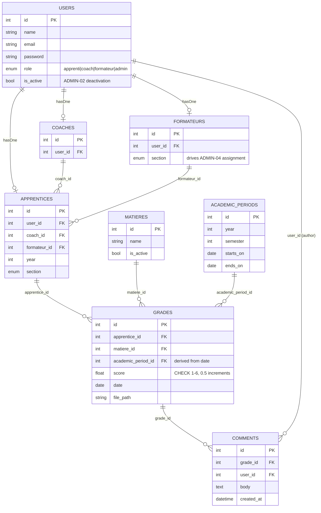

# Spec: Gestionnaire de notes

**Status:** current. Aligned against `docs/user_stories/user_story.md`, which is the **source of truth** for scope.
Where this spec disagreed with the backlog, this spec was changed — not the backlog.

| | |
|---|---|
| **Source of truth for scope** | `docs/user_stories/user_story.md` |
| **Assembly view** | `docs/spec-d/architecture.md` — system diagram, request flows, component map, deployment |
| **Sibling spec** | `docs/dossier-formation-part/spec.md` — the dossier de formation |
| **Stack decision, pending** | `docs/frontend-decision.md` — React or Vue, waiting on Bilal |
| **Reference links** | `docs/spec-d/technological_choices.md` |

Earlier revisions of this project ("Plans A–C") are **not in this repository** and are not recoverable from its git
history — they were written in a different working directory. Where an earlier decision still matters, it is restated
here rather than cross-referenced.

## Thesis

**The app replaces the Excel workbook as the system of record for grades.**

An apprenti uploads a scanned test, files it under a matière, and enters the grade. The app stores it, renames the file
to the firm's convention, shows the apprenti their record and their moyennes, and notifies the coach and formateur. No
spreadsheet in the loop at any point.

Three earlier framings are dead, and stay dead:

- **"The app finds your grade in your inbox."** Rejected. Reading an apprenti's Outlook needs a tenant admin to register
  an app in Entra ID plus a per-user Microsoft consent flow — neither self-serve for a student project, and both mean
  touching Jobtrek's real IT infrastructure. Microsoft killed IMAP basic auth in 2022, so there is no simpler path.
- **"Confirm, don't fill", via a dropped `.eml` file.** Dropped by decision. There is one intake path: the apprenti
  uploads the PDF and types the grade.
- **"The weighted CFC average is the headline feature."** Retired. GR-06 and GR-07 ask for a moyenne per matière and an
  overall moyenne whose formula is explicitly deferred, and the matière catalog (ADMIN-07) carries no category or
  weight to compute one from. See "Moyennes" below.

## Roles

Four real roles, all with a UI. This is a change: earlier revisions had formateur as notification-only and admin unresolved.

| Role | What they do |
|------|--------------|
| **Apprenti** | Uploads scanned tests, files them under a matière, enters grades, sees their own record and moyennes, edits/deletes their own grades, reads feedback. |
| **Coach** | Reads grades and PDFs for their assigned apprentices, comments on them. Read-only on grade data. |
| **Formateur** | Same read + comment access as a coach, for the apprentices assigned to them. |
| **Admin** | Creates and deactivates accounts, assigns coach and formateur, sets year and section, defines the academic calendar, manages the matière and compétence catalogs. |

Registration is admin-driven (ADMIN-01); there is no self-service signup and no self-service password reset (AUTH-05 — the locked-out user is told to contact their admin).

## Decisions taken

| # | Question | Decision |
|---|----------|----------|
| 12 | `apprentices.track` (cfc\|maturite)? | **Dropped.** Replaced by `year` + `section` per ADMIN-05. The cfc/maturité split, the track-scoped module catalog, and track-gating on module selection all go with it. |
| 13 | Weighted CFC average? | **Retired as the thesis.** Per-matière moyenne (GR-06) plus an overall moyenne whose formula is deferred (GR-07). `modules.category`, `weight_group`, the CFC weight table and the canevas fixtures are all cut. |
| 14 | `modules` table? | **Replaced by `matieres`**, admin-managed (ADMIN-07). No `number`, `type` (CIE/EPSIC), `track`, `category`, `weight_group`. |
| 15 | Admin role (was Open Question #5)? | **Resolved — in.** A full ADMIN track exists in the backlog. Accounts can be created during a demo. |
| 16 | Formateur UI? | **In.** GR-11 gives the formateur the same grade/PDF read access as a coach; GR-12 lets them comment. No longer notification-only. |
| 17 | Editing grades? | **In.** GR-08/GR-09 let an apprenti edit and delete their own grades. This reverses the earlier "Out" decision. |
| 18 | Filename prefill (`FilenameParser`, `MappingTable`)? | **Cut.** Absent from the backlog entirely. `Services/Prefill/` and the `mapping_table` are removed. |
| 19 | Rename convention? | **Known and named:** `year_semester_matiere_grade_firstname_lastname` (GR-04). The semester component is what makes the academic calendar (ADMIN-06) a dependency, not a nice-to-have. |
| 20 | Data-only grades (no PDF)? | **Out.** GR-01 makes the scanned PDF the point of the upload; no backlog story records a grade without one. Reverses the earlier "file optional" decision. |
| 21 | Comment direction? | **Two authors, one reader.** Coach *and* formateur may comment (GR-12); the apprenti reads (GR-13) and is emailed (GR-15). Still not a reply thread. |

### Retained from the stack grill (2026-08-21)

Unaffected by the realignment:

| # | Question | Decision |
|---|----------|----------|
| 5 | DB engine? | **PostgreSQL** — native enum types and `CHECK` constraints. |
| 6 | `grades.score` validation? | Swiss 1–6, half-point increments, as a Postgres `CHECK`: `score BETWEEN 1 AND 6 AND score * 2 = FLOOR(score * 2)`. |
| 8 | UI component library? | **shadcn/ui** on the existing Tailwind setup, pulled in per-surface. |
| 10 | Grade PDF storage? | Local disk (`storage/app/grades/`), served through an authorized route. |
| 11 | Real-time comments? | Inertia polling for MVP; Laravel Reverb stays a stretch item. |

Decision #7 (dossier compétences as a normalized pivot) now belongs to `docs/dossier-formation-part/spec.md`. Decision #9 (`spatie/laravel-pdf`) serves the dossier export only.

## Data model

Notes:

- **`users.role` + profile** — authentication is always against `users`; the role enum drives the redirect and the policy checks (AUTH-06); the profile row holds the domain data. `auth()->user()->apprentice` is a real `hasOne`.
- **`users.is_active`** — ADMIN-02 asks for deactivation, not deletion, so access is revoked without orphaning grades.
- **`apprentices.year` + `section`** — replace `track`. `year` is no longer an unused column: it feeds the rename convention and the academic-period lookup.
- **`formateurs.section`** — the field the admin filters on when picking a formateur (ADMIN-04). **Scoping is on `apprentices.formateur_id`, not on section** — GR-11's "apprentices in my section" resolves to "apprentices assigned to me", because ADMIN-04 makes the assignment explicit. See Open Questions #10.
- **`academic_periods`** — ADMIN-06's calendar. A grade's semester is derived by looking its `date` up against these ranges; it is stored on the row so a later calendar edit doesn't silently rewrite history.
- **`matieres`** — flat and admin-managed. No category, no weight, no section scoping (see Open Questions #8).
- **`grades.file_path`** — no longer nullable; see decision #20.
- **`grades.status` and `grades.source`** — cut. With `.eml` gone and prefill gone there is one intake path and one state.

Multiple grades per apprenti per matière are the normal case — that is what makes a per-matière moyenne meaningful. This retires the old "retakes" open question: a retake is simply another row.

## Moyennes

Two numbers, per GR-06 and GR-07:

- **Moyenne per matière** — the mean of that apprenti's grades in that matière. Plain, unweighted, computed on read.
- **Overall moyenne** — computed from the per-matière moyennes. **The formula is deliberately undefined.** GR-07 defers it to a later pass, and the matière catalog carries no weights to compute one from.

Implemented as `Services/Grading/Moyenne.php`. Until the overall formula is settled, implement the per-matière moyenne and leave the overall one behind a single, obvious seam rather than guessing a weighting.

The CFC weight table (TPI 0.4 / base élargie 0.1 / informatique 0.3 / culture générale 0.2) that earlier revisions of this spec carried is **not** deleted knowledge — it is a candidate answer for GR-07, and it is written down in `docs/spec-d/architecture.md`. It is not implemented, because nothing in the current data model can distinguish those four buckets.

## Flows

Both request flows — an apprenti submitting a grade, and a coach or formateur reviewing one — are drawn step by step in
`docs/spec-d/architecture.md`. Two properties of them are decisions rather than mechanics, so they are recorded here:

- **Everything is synchronous inside one Laravel request.** No queue worker, no background job. The known cost is that
  `GradeService::notify()` runs after the grade is already committed, so an SMTP failure surfaces as an error on a grade
  that was in fact saved. Acceptable at demo scale; queueing `notify()` is the fix if it ever bites.
- **A grade's academic period is resolved on write and stored on the row**, never derived on read, so editing the
  calendar later cannot silently reinterpret existing grades.

Posting a comment (GR-12) follows the same shape and notifies the apprenti (GR-15).

## Tech stack

| Layer         | Choice                                                       |
|---------------|--------------------------------------------------------------|
| Backend       | Laravel 12                                                   |
| Frontend      | React 19 via Inertia.js — ⏳ **open**, see `docs/frontend-decision.md` |
| Styling       | Tailwind CSS + shadcn/ui (per-component as needed)           |
| Database      | PostgreSQL — native enums, `CHECK` constraints               |
| Auth          | Laravel built-in auth; `users.role` enum + `hasOne` profile; admin-created accounts, no register, no self-service reset |
| Authorization | Laravel Policies (`GradePolicy`, `ApprenticePolicy`, `CommentPolicy`) |
| File storage  | Local (`storage/app/grades/`), served through an authorized route |
| Email         | Laravel Mail (Mailable), Mailtrap SMTP driver in dev/test    |
| Moyennes      | Plain PHP service, no library                                |
| PDF viewer    | `react-pdf`, inline render on grade detail — swaps to `vue-pdf-embed` if the frontend flips |
| Comment updates | Inertia partial reload (polling); Laravel Reverb + Echo is a stretch item |

No `maatwebsite/excel`. No MIME parser. No IMAP client. No queue driver beyond `sync`. No filename parser.

## Architecture

The component map — controllers, models, policies, mailables, services, pages — lives in
`docs/spec-d/architecture.md` under "Component map", together with the system diagram and the deployment shape. It is
not duplicated here.

**Absent by decision:** `Jobs/`, `Exports/`, `Services/Inbox/`, `Services/Prefill/`, any MIME parser, any spreadsheet
library, any OCR. See the "Out" list below.

## MVP scope

### In
- Login, persistent session, logout, password change, locked-out guidance (AUTH-01…05)
- Role-based access enforced at the policy/query layer (AUTH-06)
- Admin: create/edit/deactivate accounts, assign coach and formateur, set year and section, view all assignments (ADMIN-01…05, 09)
- Admin: academic calendar, matière catalog, compétence catalog (ADMIN-06…08)
- Apprenti: upload a scanned test, file it under a matière, enter the grade and the test date (GR-01…03, GR-16)
- Reject an out-of-range or off-step grade at submit (GR-17)
- Derive year + semester from the test date (GR-18); automatic rename to `year_semester_matiere_grade_firstname_lastname` (GR-04), re-applied on edit (GR-21)
- The stored PDF is served through an authorized route, never a public path (GR-19)
- Apprenti: own grades grouped by matière (GR-05), inline PDF render (GR-20), moyenne per matière (GR-06)
- Apprenti: edit and delete own grades (GR-08, GR-09); another apprenti's grade 403s (GR-22)
- Coach and formateur: read assigned apprentis' grades and PDFs (GR-10, GR-11), read-only (GR-24); unassigned apprentis 403 (GR-23)
- Coach and formateur: comment on a grade; apprenti reads comments with author and timestamp (GR-12, GR-13, GR-25)
- Comment thread picks up new comments by polling (GR-26)
- Email on new grade to coach + formateur with the PDF attached (GR-14, GR-27); email on new comment to apprenti (GR-15)

### Out
- **Overall moyenne formula** — GR-07 is in the backlog, the formula is deferred; ship the seam, not a guess
- `.eml` / IMAP / any email intake — decided against, not deferred
- Filename prefill and the mapping table — cut, absent from the backlog
- **OCR of the scanned test** — considered and cut. The apprenti types the grade (GR-03); filename prefill went with it (decision #18). Reference material kept in `docs/spec-d/technological_choices.md`
- Data-only grades with no PDF — cut, see decision #20
- cfc/maturité tracks and any track-gated module catalog — cut, see decision #12
- Self-service registration and password reset — admin-driven by design (AUTH-05)
- Apprenti replying to a comment — one direction, coach/formateur write, apprenti reads
- Real-time comment updates via WebSockets (Reverb) — stretch item; polling covers GR-26
- Coach/formateur approval workflow, or editing an apprenti's grade
- Excel export in any form
- OneDrive / SharePoint / Microsoft Graph
- Dossier de formation — separate spec, `docs/dossier-formation-part/spec.md`

This is a demo-quality school project, not a production deployment. Seeded fake apprenti data, so no Swiss data-protection work belongs in the budget.

## Risks

| Risk | Mitigation |
|------|------------|
| **The academic calendar is load-bearing and easy to under-build** — GR-04's rename and every semester grouping depend on ADMIN-06 existing first | Build the calendar and `AcademicCalendar` resolution in week 1, not alongside the upload form. Decide up front what happens to a grade dated outside every defined period. |
| **GR-07's undefined formula spreads** — an overall moyenne shown wrong is worse than one not shown | Do not ship a guessed weighting. Render the per-matière moyennes and leave the overall one absent or explicitly "not yet defined" until the formula is settled. |
| Admin track is larger than it looks — 9 stories, mostly CRUD, all blocking | Give it a dedicated stream from week 1; treat ADMIN-06/07 as prerequisites for the grades stream, not parallel to it. |
| Coach or formateur sees an unassigned apprenti | Policies enforced at the query layer, not UI-hidden; explicitly feature-tested including the 403 case. |
| Team learning curve (Laravel 12 + Inertia + policies + testing) | If the team hasn't shipped Laravel+Inertia before, weeks 1–2 are partly tutorial time. Open Question #7. |
| **The frontend framework is still undecided** and week 1's shared spike is where it stops being free to change | Settle `docs/frontend-decision.md` before week 1 starts, not during it. The backend is unaffected either way. |

## Workstream split (4 devs, 6 weeks)

Week 1 is **not** parallel. Every stream depends on the schema and the auth/role model, so those get built once, together, first. The realignment also moved work: the two streams that used to be `FilenameParser` and `WeightedAverage` no longer exist, and admin CRUD is now the biggest single block.

| Week | Plan |
|------|------|
| 1 | **All four, together:** migrations (users + profiles + matieres + academic_periods + grades + comments), auth, policies skeleton, bootstrap admin seeder. Ends with a schema nobody needs to change. |
| 2–4 | **A:** grade upload + form + own-record pages · **B:** `GradeService` store/rename/notify + both Mailables + Mailtrap · **C:** admin account management + assignments (ADMIN-01…05, 09) · **D:** admin catalogs + calendar (ADMIN-06…08) + `AcademicCalendar` + `Moyenne` |
| 5 | Coach/formateur review pages, comments, integration, authorization feature tests |
| 6 | Polish, demo script, buffer |

Fallback floor if a stream slips: cut the admin UI to seeders for the catalogs (ADMIN-07/08) — they are reference data, and a seeder demos the same behaviour. Cut the overall moyenne before anything else; it has no formula anyway.

## Test strategy

The full test matrix — what is unit-tested, what is feature-tested, and which negative cases are mandatory — is in
`docs/spec-d/architecture.md` under "Testability". Three rules govern it:

- **Every authorization rule is feature-tested including its negative case.** An unassigned apprenti, another apprenti's
  grade, a non-admin on an admin route: each must be an explicit test asserting **403**, not an absence of a link.
- **The suite never touches a live external service.** Notifications are asserted with `Mail::fake()`. Mailtrap is a
  dev-time eyeball tool, not a test dependency — CI needs no token and no network.
- **`AcademicCalendar` and `Moyenne` are pure and unit-tested first.** They are the two places where a silent wrong
  answer would reach a grade report, and both are cheap to test because neither touches the database.

## Open questions

Unresolved, ordered by how much they block:

1. **Overall moyenne formula (GR-07)** — explicitly deferred by the backlog. Blocks GR-07 only; everything else ships without it. Needs a decision about whether matières carry weights at all.
2. **Are matières scoped?** ADMIN-07 describes one flat, admin-managed list. Nothing says a first-year apprenti shouldn't be offered a fourth-year matière, and the old track-gating that would have prevented it is gone. If scoping is wanted, `matieres` needs a section and/or year and GR-02 needs a rule.
3. **What are the valid `section` values?** ADMIN-05 introduces section; no story enumerates it. The dossier spec's v1 scope names "Informatique développement d'applications", which suggests at least one more exists.
4. **A grade dated outside every academic period** — reject, or store with a null period? GR-04's rename needs a semester, so this is not a cosmetic edge case.
5. **Deactivation semantics (ADMIN-02)** — a deactivated apprenti's grades stay, but do they still appear on their coach's list? Does a deactivated coach's apprentices become unassigned?
6. **Deployment + CI** — is the demo localhost, or hosted? Does CI exist, or are tests run locally? Still unstated.
7. **Team's prior Laravel+Inertia experience** — determines whether week 1's shared spike is one week or two.
8. **Editable grades vs. the notification** — GR-08 lets an apprenti edit a grade after GR-14 already emailed it. Does an edit re-notify, or silently diverge from the mail the coach already has?
9. **GR-11's wording** — "apprentices in my section" is read here as "assigned to me" (see the data-model note). Confirm, because section-wide access is a materially wider boundary.

## Next steps

1. **Settle Open Questions #2, #3 and #4** — they shape the schema, and week 1 *is* the schema
2. **Settle `docs/frontend-decision.md`** (React or Vue) and Open Question #7 — both must land before week 1, not during it
3. Week 1 group spike: migrations, auth + roles, policies skeleton, bootstrap admin seeder
4. Split per the workstream table above
5. Revisit GR-07's formula once there is real grade data to sanity-check it against
